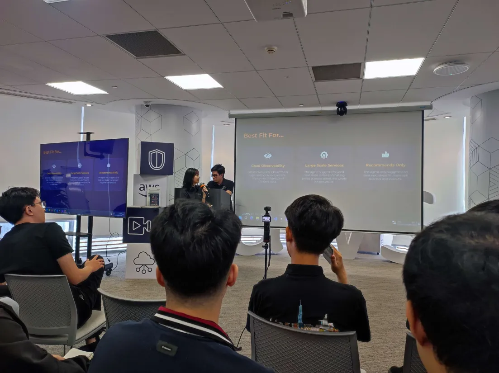

# Summary Report: "FCAJ Community Day - June 2026"

### Event Objectives

- Provide career orientation in Cloud Computing and introduce Cloud Thinker.
- Demystify Voice AI Agents, their architectures, and real-world enterprise applications in low-resource languages like Vietnamese.
- Introduce DevOps AI Agents (e.g., AWS DevOps Guru, Amazon Q Developer) and how they automate incident response and root cause analysis (RCA).
- Explore the role of Generative AI (e.g., Amazon Q Business) in Human Resource (HR) management, automating JD creation, resume screening, and candidate evaluation.
- Design and establish secure, private connections for Amazon Q Business using Private MCP Servers to mitigate security risks.

### Speakers

- **Steve Tran** – Founder of Cloud Thinker, former AWS Solutions Architect
- **Danh Hoang Hieu Nghi** – AI Engineer at Renova Cloud, AWS Community Builder
- **Kiet** – AWS Study Builder
- **Trung Do** – CEO of R AI
- **Ms. Bao** – Cloud Engineer at Cloud Kinetic
- **Nguyen Nguyen** – Cloud Engineer at Cloud Kinetic
- **Truong** – Solutions Architect at Noventic
- **Minh Anh** – Solutions Architect at Noventic
- **Toan Nguyen** – AWS Security Builder

---

### Key Highlights

#### 1. Career Orientation with Cloud & Introduction to Cloud Thinker (Steve Tran)
- **Career Journey:** The speaker shared his personal journey starting at age 19, dropping out of college to maintain physical servers for Contact Centers. He self-studied Cloud (failing Azure certifications 3-4 times before switching to AWS) and became an AWS Solutions Architect in 4 years by anticipating the Cloud boom during the COVID-19 pandemic.
- **AI Era Challenges:** He warned that companies are reducing hiring for Developer/Cloud Junior roles and shifting toward leveraging AI tools coordinated by Senior professionals. He strongly advised students to start interning and gaining real-world business experience early.
- **Cloud Thinker:** Introduces a solution addressing system complexity and technical debt that arises as enterprise infrastructures expand.
- **Multi-Agent Architecture:** Explained the selection of a Multi-Agent architecture (multiple specialized AI Agents) over a Single Agent model to optimize context processing costs, enforce Role-Based Access Control (RBAC), and manage operations across complex environments without hallucination.

#### 2. Voice AI Agent & Real-world Applications (Hieu Nghi, Kiet & Trung Do)
- **Voice AI Architectures:** Introduced two main architectures for voice systems: direct Speech-to-Speech and the hybrid 3-step pipeline (Speech-to-Text → LLM processing → Text-to-Speech).
- **Live Demo:** Demonstrating an English-speaking Voice Agent built on AWS Bedrock integrated with a Knowledge Base to retrieve product details about Apple MacBooks.
- **Vietnamese Voice AI for Enterprise:** Vietnamese is a low-resource language, which makes it challenging. R AI implements the 3-step pipeline for major banks (VPBank, VIB) to control response safety in real-time and execute tool calls such as freezing a card.
- **Advanced Features for Vietnamese:**
  - **Streaming:** Processes audio as a stream to minimize latency.
  - **Auto-Gender Detection:** Automatically detects gender to utilize appropriate honorifics (anh/chị).
  - **Interruption Handling:** Trains models to recognize natural pauses for realistic interruption handling.
  - **Human-in-the-loop Transfer:** Seamlessly transfers difficult cases from the AI to human call center operators.
  - **Accent Processing:** Integrates 10-20% regional dialect data into training datasets to handle accent variations.

#### 3. DevOps AI Agent (Bao & Nguyen Nguyen)
- **Traditional DevOps Pain Points:** During incidents, engineers waste valuable time searching for logs and traces across disparate systems, facing frequent interruptions that extend the Mean Time to Resolution (MTTR).
- **DevOps AI Agent Solution:** Automatically learns the system context through "Agent Space" (which isolates resource permissions using Tags) to construct a topology map of the architecture.
- **Pricing Model:** Billed based on execution time (~$0.083 per second) rather than token count.
- **4-Step Incident Response:**
  1. Classify and extract alert details when an alert is triggered.
  2. Conduct Root Cause Analysis (RCA) to diagnose the issue.
  3. Propose a mitigation plan (recommendations only; the agent does not execute them automatically for security).
  4. Propose long-term architectural improvements.
- **Live Demo:** Simulated a mock DDoS attack (1,000 requests/sec) against an e-commerce application running on ECS. The DevOps Agent scanned the system, diagnosed the issue, and generated specific terminal commands. The engineer copied these commands into the terminal to terminate malicious ECS tasks, returning the application to a normal state.
- **Real-World Case Studies:** Proven to reduce incident resolution times for major clients from hours or weeks down to minutes or days (e.g., Western Governors University reduced MTTR by 77%).

#### 4. AI in Human Resource Management (Truong & Minh Anh)
- **HR Pain Points:** Manual resume screening leads to missed talent, long onboarding cycles (1-2 months time-to-hire), subjective evaluations, and data privacy risks when uploading candidate resumes to public AI engines.
- **Amazon Q Business Solution:** An enterprise AI Chat Agent that connects to diverse corporate repositories (Microsoft Sharepoint, OneDrive, Google Drive, Gmail, Jira, GitHub, S3) to consolidate scattered data. It employs persistent context storage to save token costs.
- **Live Demo of Automated HR:**
  - Created a specialized "HR Talent Review Assistant" Skill using custom markdown instructions.
  - Automatically drafted a Job Description (JD) for a Junior Cloud Engineer position from company templates.
  - OCR-scanned resumes, matched them against the JD, and categorized candidates (Strong, Good, Low, Very Low) with detailed rationales.
  - Exported an interactive HTML Talent Review report scoring core competencies (Technical, Problem Solving, Communication) and recommending salary bands.

#### 5. Securing Amazon Q Business with Private MCP Server (Toan Nguyen & Hieu Nghi)
- **Security Risks:** AI Agents connecting to third-party MCP servers via the public internet are exposed to DDoS or Man-in-the-Middle attacks.
- **Private Connection Solution:** Utilizes AWS VPC Connection to route Amazon Q traffic into private subnets. It resolves names via Route 53 Resolver and routes through an ALB secured with ACM certificates. API calls to external services like Zalo, WhatsApp, or Slack bypass the public internet entirely.
- **Technical Demo:** Proved that queries from Amazon Q fail when initiated from public IPs, while safely retrieving real-time metrics (latency, running services) from the private network.
- **Cost Estimate:** Monthly operational costs range between $250 - $350, including fixed charges for Route 53 Resolver (~$180), ALB (~$32), EC2 compute, and variable data transfer fees.

---

### Key Takeaways

#### Design Mindset
- **Multi-Agent Systems:** Structuring systems using multiple specialized agents instead of a single agent helps manage context boundaries and prevent hallucinations in complex tasks.
- **Private AI Design:** Secure enterprise AI integrations must keep backend API queries completely off the public internet by routing them through private VPC subnets.
- **Agent Spaces & Tags:** Organizing permissions via tags and dedicated agent spaces simplifies security boundaries and access controls for AI agents.

#### Technical Architecture
- **Multi-Stage Voice Pipeline:** Processing low-resource languages like Vietnamese is best done through a hybrid STT → LLM → TTS pipeline optimized with streaming audio and regional data.
- **AI-Driven Operations:** Integrating monitoring tools with DevOps AI Agents accelerates troubleshooting and drastically cuts down MTTR by automatically generating diagnostic insights and recovery commands.
- **Enterprise Connectors:** Amazon Q Business Connectors allow companies to easily index and query fragmented corporate files under strict access permissions.

#### Modernization & AI Integration
- **Human-in-the-Loop:** Enterprise AI implementations in sensitive workflows (like HR) should assist and recommend rather than execute decisions autonomously.
- **Infrastructure Cost Planning:** When designing secure, private integrations for AI, calculate networking costs (like Route 53 Resolver endpoints and ALBs) early to optimize operational spend.

---

### Applying to Work

- **Explore Voice AI Pipelines:** Build simple voice-enabled assistant prototypes using AWS Bedrock and explore latency optimization techniques.
- **Leverage DevOps Assistants:** Integrate tools like Amazon Q Developer into local coding workflows to automate error analysis and code generation.
- **Automate Document Workflows:** Experiment with indexing local text files and markdown documents using RAG or Amazon Q Business to automate data retrieval.
- **Implement Private APIs:** Practice setting up secure API routes using VPC Private Subnets and DNS resolution to secure internal service communications.
- **Adopt Multi-Agent Systems:** Split complex tasks into multiple specialized agents when building LLM applications to improve accuracy and efficiency.

---

### Event Experience

Attending the **FCAJ Community Day - June 2026** was an eye-opening experience that highlighted the transition of Generative AI from theory into robust enterprise applications.

- **Practical Enterprise Solutions:** Demos showing how banks (VIB, VPBank) or corporate HR systems implement AI gave realistic blueprints for corporate applications.
- **Deep Technical Insight:** Gained practical understanding of AI architecture, from voice streams to secure enterprise search.
- **Inspiring Careers:** Steve Tran's journey from a server maintenance engineer to an AWS Solutions Architect and Founder demonstrated the power of self-learning, adaptability, and catching trends.
- **Networking Opportunities:** Connecting with developers, cloud engineers, and security builders at FCAJ Community Day offered highly valuable discussions and new insights.

#### Some event photos

> The FCAJ Community Day - June 2026 was a highly inspiring event, showing that AI is no longer a futuristic concept but a practical tool integrated deeply into software development, voice processing, operations, and enterprise administration.
