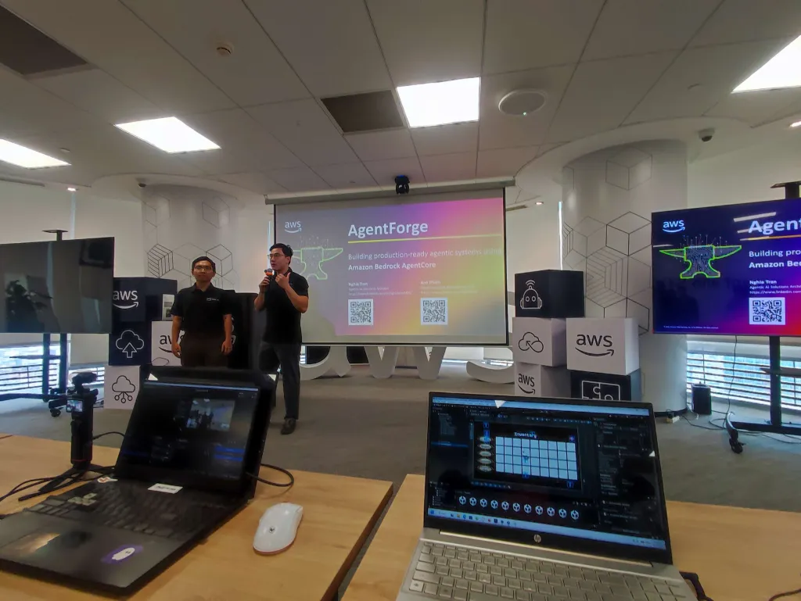
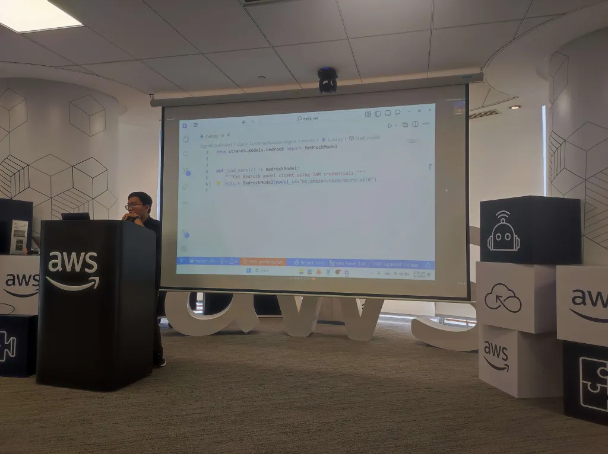

# Summary Report: "AWS FCAJ Agent Forge - Deepdive"

### Event Objectives

- Introduce and define core concepts in the new GenAI era: **RAG** (Retrieval-Augmented Generation), **Agentic AI**, and **Graph RAG** (Knowledge Graph-based RAG).
- Provide hands-on access to the latest Generative AI and AI Agent trends on the AWS platform, while unlocking logical thinking and breakthrough problem-solving skills for "Builders".
- Help learners understand how to transition AI solutions from Proof of Concept (PoC) to optimized and secure production-ready enterprise environments.

### Speakers

- **Ms. Lam Hoang Cat Vy** – Senior Systems Analyst - AI Platform Owner - IT Young Talents Program Manager.
- **AWS Study Group** – Host Organization.

---

### Key Highlights

#### 1. RAG (Retrieval-Augmented Generation) Definition
- **Concept:** RAG is a technique that optimizes Large Language Model (LLM) output by retrieving information from an external authoritative knowledge source (like an internal enterprise database or documents) before generating a response.
- **Role:** Enables LLMs to answer accurately, update information in real-time, and minimize hallucinations without the high cost of model fine-tuning.

#### 2. Agentic AI & Autonomous Intelligence
- **Concept:** Agentic AI represents the next layer of highly autonomous AI applications (Autonomous Agents). Going beyond simple Q&A, Agentic AI is capable of reasoning, planning step-by-step, and automatically invoking external tools (Tools/APIs) to complete complex objectives.
- **Collaboration:** The Multi-Agent trend allows breaking down large objectives into smaller tasks and delegating them to specialized agents for automatic resolution.

#### 3. Graph RAG - The Next Big Step
- **Concept:** Graph RAG is an advanced integration of traditional RAG and Knowledge Graphs.
- **Mechanism:** Unstructured data is processed to extract entities and their relationships, constructing a tightly linked knowledge network.
- **Advantages:** Empowers LLMs to comprehend global contexts and connect scattered information across thousands of documents, solving synthesis queries that traditional RAG typically misses.

#### 4. Enterprise Deployment Solutions on AWS
- Utilize **Amazon Bedrock** to seamlessly connect to leading foundation models (Claude 3.5 Sonnet, Amazon Nova, etc.).
- Set up **Amazon Bedrock Knowledge Bases** to automate RAG workflows (Chunking, Embedding, Vector Storage).
- Integrate **Amazon Neptune** or graph-supported databases to store Knowledge Graph data for large-scale Graph RAG solutions.

---

### Key Takeaways

#### Design Mindset & Problem Solving
- **Unlocking Logical Thinking:** Learned how to systematically analyze problems and structure data in entity-relationship models to apply effectively to Graph RAG architectures.
- **Breakthrough Problem-Solving Skills:** Discovered how to flexibly combine traditional RAG, Graph RAG, and Agentic AI to resolve complex enterprise business scenarios.

#### Technical Architecture
- Deeply understood the core differences and optimal use-cases for RAG (suitable for detailed, localized queries) versus Graph RAG (suitable for broad, relationship-synthesized queries).
- Mastered designing the Reasoning - Planning - Execution loop for autonomous AI agents on AWS Cloud.

---

### Applying to Work

- **Implementing RAG & Graph RAG:** Research integrating RAG into internal documentation databases or game assistance for the RPG project (AI Dungeon Master). Explore constructing a knowledge graph to transition to Graph RAG.
- **Designing Autonomous AI Agents:** Apply Agentic AI design principles to backend services to automate complex game-logic workflows and dynamic player interactions.
- **Optimizing AWS Infrastructure:** Leverage the AWS Bedrock ecosystem to build, rapidly deploy, and securely run serverless AI Agent applications.

---

### Event Experience

Attending the **AWS FCAJ Agent Forge - Deepdive** session led by speaker **Vy Lam** provided invaluable insights and experiences:

- **Inspiring Speaker:** Through her deep, practical, enthusiastic, and high-energy sharing, Ms. Lam Hoang Cat Vy strongly motivated the "Builders".
- **Unlocking Tech Mindset:** The event not only offered a gateway to the latest Generative AI and AI Agent trends on AWS but also unlocked logical thinking and breakthrough problem-solving skills.
- **High-Quality Lessons:** Practical examples of RAG, Agentic AI, and Graph RAG demystified many concerns about designing and implementing real-world enterprise AI solutions.

#### Some event photos

> Ms. Vy Lam's sharing session has fueled my energy and clearly shaped my design thinking for professional AI Agent & RAG systems, leaving me ready to embrace and deploy the most advanced AI solutions on the AWS platform.
